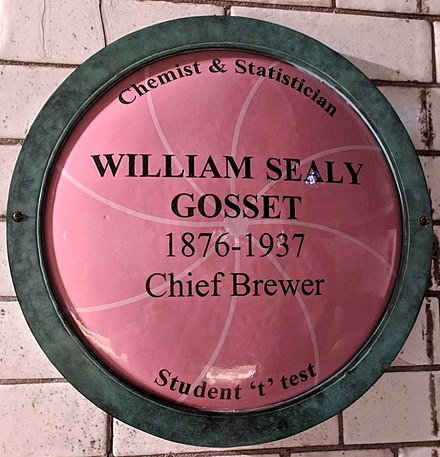

```{r setup, include=FALSE}
library(learnr)
library(data.table)
library(ggplot2)
library(magrittr)
library(plotly)
learnr::initialize_tutorial()
```

## Sampling recap

### Abraham Wald


### Central Limit Theorem

What did you discover about the sampling distribution of the variance, the standard deviation, and its logarithm?

## Maximum likelihood estimation

Remember our friends `P1`, `P2`, and `P3`? They were three competing models that may or may not have generated the data 'tails, heads, tails' (equivalently: '1, 0, 1').

```{r binomial}
P1 <- function() {
  rbinom(3, size = 1, prob = 1/3) %>% paste(collapse = "") # three tosses of a single coin
}

P2 <- function() {
  rbinom(3, size = 1, prob = 2/3) %>% paste(collapse = "")
}

P3 <- function() {
  rbinom(3, size = 1, prob = 3/3) %>% paste(collapse = "")
}
```

*Maximum likelihood estimation* involves identifying the model that makes the data we observed most likely to have occurred. We saw last time that `P2` was twice as likely to produce this data as `P1`, and that `P3` could never produce this data. In this case, `P2` is our maximum likelihood estimate, or MLE.

> A *point estimate* is just a single model ("point") --- or a single instance of model parameter(s) --- that we have identified as somehow relevant to a scientific question of interest ("estimate"). You can think of the point estimate as the leader of a gang of models.

What would be the MLE for the other possible datasets we could have had?

```{r mles, exercise = TRUE, exercise.setup = "binomial"}
nSims <- 1e3
data.table(model = "P1", result = replicate(nSims, P1())) %>%
  rbind(data.table(model = "P2", result = replicate(nSims, P2()))) %>%
  rbind(data.table(model = "P3", result = replicate(nSims, P3()))) -> fr

ggplot(fr, aes(x = result, fill = model)) + geom_bar()
```

What do the models where `P1` wins have in common? How about `P2`? And `P3`?

So we can easily work out the MLE when there are only three models to choose from. But what happens when our set of candidate models is bigger? Infinite? Uncountably infinite, even?

For example: we could have a set $\{P_{\theta}: \theta \in [0, 1]\}$ of candidate models, where $P_{\theta}$ corresponds to three independent tosses of a coin that has probability $\theta$ of landing 'tails'.

> Think of $\{P_{\theta}: \theta \in [0, 1]\}$ as a box containing all the
> models we're considering.

We can't try them all, so we need another way to tackle this. We know that the total number of 'tails' $X$ satisfies

$$P_{\theta}(X = x) \propto \theta^{x}(1 - \theta)^{3 - x}$$
which looks something like the following graph:

```{r bin-like, exercise = TRUE}
expand.grid(x = 0:3, theta = seq(0, 1, by = 0.01)) %>% data.table() %>%
  extract(, prop := theta^x * (1 - theta)^(3 - x)) %>%
  ggplot(aes(x = theta, y = prop)) + geom_line() + facet_grid(x ~ ., scales = "free_y")
```

Can you work out numerically what these MLEs should be, for each of $X = 0, 1, 2, 3$?

```{r mle-optim, exercise = TRUE}
likelihood <- function(theta, x) theta^x * (1 - theta)^(3 - x)

optimize(likelihood, interval = 0:1, x = 0, maximum = TRUE)
# repeat for x = 1, 2, 3
```

```{r mle-optim-solution}
optimize(likelihood, interval = 0:1, x = 0, maximum = TRUE)
optimize(likelihood, interval = 0:1, x = 1, maximum = TRUE)
optimize(likelihood, interval = 0:1, x = 2, maximum = TRUE)
optimize(likelihood, interval = 0:1, x = 3, maximum = TRUE)
```

In fact, it is not too difficult to show that this likelihood is maximized at exactly $\theta = \frac{x}{3}$ in our case, and $\theta = \frac{x}{n}$ in general.

In principle, it doesn't matter how many models we're choosing among, or how many parameters are needed to specify these models:

> Maximum likelihood estimation chooses the model that makes the data most likely. This is one (very widely-used) way to 'elect' a leader from our box of models.

Can you think of any situations in which this might be difficult to do in
practice, or even a bad idea in principle?

Here's an example of a two-parameter model (mean and standard deviation), where we find out which Normal distribution makes our data most likely to have occurred. Run it a few times to see how the MLEs move around with the data.

```{r mean-var-optim, exercise = TRUE}
x <- rnorm(30, mean = 19, sd = 7)
hist(x, xlim = c(0, 50), ylim = c(0, 20))

loglik <- function(pars, x) dnorm(x, mean = pars[1], sd = pars[2], log = TRUE) %>% sum()

optim(c(mean = 0, sd = 1), loglik, x = x, control = list(fnscale = -1))
```

If there's a tie for 1st place, then the MLE is not unique.

It's really pretty important that we're choosing among a restricted class of models. Ask yourself what an MLE would be if our class of models to choose from included all possible data-generating mechanisms? If it helps to think of an example, ask yourself what the MLE(s) might be to explain why your tutor failed to turn up to teach today?

## Likelihood intervals

Point estimation  picks out a single model from a set of candidate models, for instance  --- in the case of maximum likelihood estimation --- the model that makes the data most likely.

To supplement point estimation, we may wish to also identify a subset of models (data generating mechanisms / theories / parameters) that are broadly consistent with the data.

> Think of *the set of models broadly consistent with the data* as an exclusive
> club: models are only allowed in if they fit the data reasonably well.

One of the simplest ways to do this is using the likelihood again: pick a cutoff relative to the maximum likelihood estimate, and exclude any model whose probability of giving rise to the observed data is smaller than this cutoff.

### One parameter

Here are the likelihoods for each possible number of tails associated with each model:

```{r likelihoods, echo = FALSE}
data.table(n_tails = 0:3) %>%
  extract(, P1 := choose(3, n_tails) * (1/3)^n_tails * (2/3)^(3 - n_tails)) %>%
  extract(, P2 := choose(3, n_tails) * (2/3)^n_tails * (1/3)^(3 - n_tails)) %>%
  extract(, P3 := choose(3, n_tails) * (3/3)^n_tails * (0/3)^(3 - n_tails)) -> likelihoods
```

```{r show-likelihoods, exercise = TRUE, exercise.setup = "likelihoods"}
print(likelihoods)
```

The columns sum to 1, but when thinking in terms of likelihoods we are actually more interested in the rows: which model made the data we actually observed most likely, or at least relatively likely?

For our `P1`, `P2`, `P3` example, which models would be in a 1/8 likelihood interval (likelihood set, really) for each possible value of the data? Replace the `...` with an expression that compares the relevant probability (e.g. `P1`) with `MLE_prob` to find out. Who's in? Who's out?

```{r like-interval, exercise = TRUE, exercise.setup = "likelihoods"}
likelihoods[, MLE_prob := pmax(P1, P2, P3)]
likelihoods[, P1_in := ... >= 1/8] # is P1 in?
likelihoods[, P2_in := ... >= 1/8] # is P2 in?
likelihoods[, P3_in := ... >= 1/8] # is P3 in?

likelihoods
```

```{r like-interval-solution}
likelihoods[, P1_in := P1 / MLE_prob >= 1/8] # is P1 in?
likelihoods[, P2_in := P2 / MLE_prob >= 1/8] # is P2 in?
likelihoods[, P3_in := P3 / MLE_prob >= 1/8] # is P3 in?
```

Now let's use that larger (okay, *much* larger) set of candidate models, $\{P_{\theta}: \theta \in [0, 1]\}$. If the data are 'tails, heads, tails' as before, we know the MLE is for $\theta$ is 2/3, but what other models would be admitted to the (exclusive club) 1/8 likelihood interval?

Add a dashed vertical reference line (`geom_vline()`) to the following plot at $\theta = 2/3$, and a horizontal reference line (`geom_hline()`) where the relative likelihood is 1/8. 

```{r continuous-interval, exercise = TRUE}
data.table(theta = seq(0, 1, by = 0.01)) %>%
  extract(, likelihood := choose(3, 2) * theta^2 * (1 - theta)^1) %>%
  extract(, relative_likelihood := likelihood / max(likelihood)) %>%
  ggplot(aes(x = theta, y = relative_likelihood)) + geom_line() +
  ... # add reference lines here
```

```{r continuous-interval-solution}
  geom_vline(xintercept = 2/3, linetype = "dashed") +
  geom_hline(yintercept = 1/8, linetype = "dashed")
```

We can repeat this exercise for every possible value of the number of tails (0, 1, 2, 3):

```{r all-likelihoods, exercise = TRUE}
expand.grid(theta = seq(0, 1, by = 0.01), n_tails = 0:3) %>% data.table() %>%
  extract(, likelihood := choose(3, n_tails) * theta^n_tails * (1 - theta)^(3 - n_tails)) %>%
  extract(, relative_likelihood := likelihood / max(likelihood), by = n_tails) %>%
  ggplot(aes(x = theta, y = relative_likelihood)) + geom_line() + facet_grid(n_tails ~ .) +
  geom_hline(yintercept = 1/8, linetype = "dashed")
```

The arbitrariness of where to end the set or interval will be a recurring theme today! But notice

- there is no further ambiguity once the cutoff is set
- it doesn't matter how we parametrize the distribution (e.g. in terms of odds)
- the (extreme) asymmetry of some of the intervals
- no asymptotics are required: these are finite sample properties
- this example provides a point of reference: 1/8 is the chance of three tails in a row on a fair coin
- the interval only contains data-generating mechanisms that
  * (a) actually exist
  * (b) can actually give rise to the data

### More parameters

This is now harder, because often we are only really interested in one aspect of the model --- the mean, say --- the rest being basically a *nuisance*.

> We often call parameters we aren't interested in *nuisance parameters*.

Run the following code to explore the shape of the (log-)likelihood function as a function of both the mean ($\mu$) and the standard deviation ($\sigma$) of the hypothesised normal distribution.

```{r mean-var-surface-setup}
set.seed(0)
```

```{r mean-var-surface-plot, exercise = TRUE, exercise.setup = "mean-var-surface-setup"}
x <- rnorm(30, mean = 19, sd = 7)

expand.grid(mu = seq(10, 30, by = 1), sigma = seq(5, 10, by = 1)) %>% data.table() %>%
  extract(, loglik := dnorm(x, mean = mu, sd = sigma, log = TRUE) %>% sum(),
          by = list(mu, sigma)) -> likelihoods

likelihoods %>%
  plot_ly(x = ~mu, y = ~sigma, z = ~loglik, color = ~loglik,
          type = "scatter3d", mode = "markers")
```

Now modify the code so that it explores a denser grid of points (`seq(..., by = 0.1)`, for example) but only plots the points within (say) 4 log-likelihood units of the maximum. Can you colour the points according to whether they are within (say) 2 log-likelihood units? Roughly, this consitutes a 1/8 likelihood region.

```{r mean-var-surface, exercise = TRUE}
x <- rnorm(30, mean = 19, sd = 7)

expand.grid(mu = seq(10, 30, by = 1), sigma = seq(5, 10, by = 1)) %>% data.table() %>% # change by = 1 to something smaller
  extract(, loglik := dnorm(x, mean = mu, sd = sigma, log = TRUE) %>% sum(),
          by = list(mu, sigma)) -> likelihoods

likelihoods[, within4 := ...] # modify so TRUE iff max(loglik) - loglik < 4
likelihoods[, within2 := ...] # modify so TRUE iff max(loglik) - loglik < 2

likelihoods[...] %>% # change ... so that only points within 4 are included
  plot_ly(x = ~mu, y = ~sigma, z = ~loglik, color = ~loglik, # change color = ~ loglik to indicate which are within 2
          type = "scatter3d", mode = "markers")
```

```{r mean-var-surface-solution}
expand.grid(mu = seq(10, 30, by = 0.1), sigma = seq(5, 10, by = 0.1)) %>%
  data.table() %>%
  extract(, loglik := dnorm(x, mean = mu, sd = sigma, log = TRUE) %>% sum(),
          by = list(mu, sigma)) -> likelihoods

likelihoods[, within4 := max(loglik) - loglik < 4]
likelihoods[, within2 := max(loglik) - loglik < 2]

likelihoods[within4 == TRUE] %>%
  plot_ly(x = ~mu, y = ~sigma, z = ~loglik, color = ~within2,
          type = "scatter3d", mode = "markers")
```

Rotate the graph to view it from 'above'. What are the lowest and highest values of $\mu$ appearing in this 1/8 likelihood region? How about for $\sigma$?

An alternative to this three-dimensional viewpoint is to try to concentrate the likelihood on the parameter of interest --- $\mu$, say. This can be done in a few different ways.

- The most general purpose way is called profile likelihood. This involves looking at the likelihood surface from the 'side' (profile), so that all we see is the biggest possible value of the likelihood achievable with that value $\mu$. (But does it compare apples to oranges?)

- Sometimes, we can condition on a function of the data that removes dependence on the nuisance parameters ($\sigma$, in this case). This is called *conditional likelihood*.

- Alternatively, we can find some function of the data that does not directly depend on the nuisance parameters. This is called a *marginal likelihood*.

In this case, we can directly examine the marginal distribution of $$T = \frac{\bar{X} - \mu}{S / \sqrt{n}}$$ and uncover a $t$-distribution that depends only on $\mu$ (and the sample size).

## The $t$-distribution

{width="50%"}

> "The usual method of determining the probability that the mean of the population lies within a given distance of the mean of the sample, is to assume a normal distribution about the mean of the sample with a standard deviation equal to $s/\sqrt{n}$, where $s$ is the standard devaition of the sample, and to use the tables of the probability integral.
>
> But, as we decrease the number of experiments, the value of the standard deviation found from the sample of experiments becomes itself subject to an increasing error, until judgements reached in this way may become altogether misleading." --- Student, *Biometrika*, 1908

We can see the problem "Student" was describing in the following exercise. What happens when we try larger sample sizes than 5? Smaller? How low can you go?

```{r small-sample, exercise = TRUE}
z <- replicate(1e3, rnorm(5, mean = 0, sd = 1)) %>%
            apply(2, function(x) sqrt(5) * mean(x) / sd(x))

qqnorm(z)
qqline(z)
```

{width="50%"}

There are actually lots of examples where this still happens today, and in fact what is sometimes called "researcher degrees of freedom" (or that Andrew Gelman calls the "garden of forking paths") is a really big problem for science more generally. Variable selection is just one example where we tend to ignore the fact that we have used the data to decide what variables to include in our model. What kind of problems might this lead to?

Gosset showed that $$T = \frac{\bar{X} - \mu}{S / \sqrt{n}}$$ has a particular (non-Normal) distribution that does not depend on $\sigma$. We can use this to form a marginal likelihood interval for $\mu$:

```{r marginal-likelihood-setup}
set.seed(0)
```

```{r marginal-likelihood, exercise = TRUE}
x <- rnorm(30, mean = 19, sd = 7)

data.table(mu = seq(15, 25, by = 0.1)) %>%
  extract(, loglik := dt(sqrt(30) * (mean(x) - mu) / sd(x), df = 29, log = TRUE)) %>%
  ggplot(aes(x = mu, y = loglik)) + geom_line() +
  geom_hline(yintercept = log(1/8), linetype = "dashed")
```

How does this compare with the profile likelihood interval?

The $t$-distribution crops up *a lot* (as we shall see).

## Bayesian credible intervals


### Bayesian estimation

Bayesian statisticians use data to update their *prior* beliefs about the relative likelihood of the set of candidate models (say `P1`, `P2`, and `P3` again).

Bayes' theorem allows us to assess

$$P(\mathrm{model} \mid \mathrm{data}) \propto P(\mathrm{data} \mid \mathrm{model}) \times P(\mathrm{model})$$

The left-hand side of this expression is called a *posterior* probability.

We can now ask which model has the biggest posterior! This is again *point estimation*: choosing a leader from our box of models.

Assign a prior to each of `P1`, `P2`, and `P3`, and work out their posterior probabilities given the data 'tails, heads, tails'.

```{r bayes, exercise = TRUE}
prior <- c(P1 = ..., P2 = ..., P3 = ...) # choose prior probs that add to one!
theta <- c(P1 = 1/3, P2 = 2/3, P3 = 3/3)
probs <- choose(3, 2) * theta^2 * (1 - theta)^1
posterior <- probs * prior / ... # "normalise" this expression so the post. probs add to one, too

posterior
```

```{r bayes-solution}
prior <- c(P1 = 0.1, P2 = 0.2, P3 = 0.7) # for example
posterior <- probs * prior / sum(probs * prior) # notice the post. prob of P3!
```

This procedure coincides with maximizing the likelihood if $P(\mathrm{model}) \propto 1$: a *uniform prior*. But this isn't always possible, or advisable.

NB: it is impossible to specify ignorance! The uniform distribution is *not* such a statement -- rather, it is the strong statement that all models are equally likely.

### One parameter

Because the choice of model now has a probability distribution, we can form a so-called credible interval (or set) by grabbing whatever percentage of this we want. This is how Bayesians form their "exclusive club" of well-fitting models.

For example, we might believe *a priori* that the model is `P2` or `P3` with probability 0.9, but *a posteriori* have updated the probability of this set to 0.8. The set {`P2`, `P3`} would be a 80% posterior credible interval. But note that, in this case, all of that 80% is in fact concentrated on `P2`! (Why did this happen?)

### A more complex example

```{r, include=FALSE}
secret <- pi
```

Here's an example that's closer to what happens in real life. First imagine we're trying to estimate the mean of some quantity, say the temperature in degrees on Christmas Day.

At least notionally, we should pick our prior *before* seeing the data, so let's do that.

```{r}
# pick a prior
prior <- list(mean = 0, sd = 4)
```

Now here's 10 years worth of data:

```{r}
# ten years' data with known SD but top-secret mean
n <- 10
y <- rnorm(n, mean = secret, sd = 1)
print(y)
```

The following codeblock uses so-called *rejection sampling* to sample from the posterior distribution of the secret mean given the temperature data, without having to be able to write it down explicitly. 

> Techniques like rejection sampling (and MCMC) have made Bayesian statistics
> practicable even when the maths gets complicated or impossible!

Update the call to `ggplot()` to show a comparison of prior and posterior, and
the call to `quantile()` to extract a 95% credible interval for the mean
temperature on Christmas Day.

```{r bayes-update, exercise = TRUE}
# use rejection sampling to approximate the posterior
bayes_update <- function(nTries = 1e5) {
  candidates <- rnorm(nTries, mean = prior$mean, sd = prior$sd) # proposal = prior
  prob_accept <- sapply(candidates, function(candidate) {
    prod(dnorm(y, mean = candidate, sd = 1)) * (2 * pi)^(n/2) # likelihood (and bound)
  })
  accept <- as.logical(rbinom(nTries, size = 1, prob = prob_accept))
  data.table(mu = c(candidates, candidates[accept]),
    distn = c(rep("prior", nTries), rep("posterior", sum(accept))))
}

# replace ... to plot the densities of the mean (mu) coloured by distn
ggplot(bayes_update(), aes(x = ..., colour = ...)) + geom_density() 

# replace ... to find the central 95% posterior credible interval
quantile(bayes_update()[distn == "posterior", mu], c(...))
```

```{r bayes-update-solution}
ggplot(bayes_update(), aes(x = mu, colour = distn)) + geom_density() 

quantile(bayes_update()[distn == "posterior", mu], c(0.025, 0.975))
```

### More parameters

Bayesians can marginalise over other parameters to focus on aspects of inference that are most relevant to the problem at hand. Note that

- we *can* talk about the probability that a model is 'true' (better: 'best')
- $t$-distributions arise again, as marginal posterior distributions
- there is some ambiguity here: we can choose more than one (say 95%) credible interval
- Bayesians often choose the interval of highest posterior density (roughly, the shortest interval)
- once again, the interval only contains data-generating mechanisms that
  (a) actually exist
  (b) can actually give rise to the data

> Despite the many attractions of Bayesian inference, this is still not universally accepted, at least partly because of the important and not-always-obvious role of the prior.

## Confidence intervals

There are several ways of creating and defining confidence intervals: they are neither a single concept nor a simple concept. In general terms, confidence intervals (or confidence sets) again consist of a subset of models *broadly consistent with the observed data*.

### Inverted significance tests

I suggest you think about confidence intervals as being 'inverted' significance tests. Remember that a significance test of a model $P$ is some procedure with the property that,

$$P(\mbox{we reject $P$}) = 0.05$$

(say), always remembering that there's nothing magical about 5%. Explain to someone else what this apparently simple statement means.

If we have such a significance test for each model $P \in {\cal P}$, and form the set \(\hat{\cal P} = \{P: \mbox{$P$ not rejected}\}\), notice that for all models $P \in {\cal P}$

$$P(\mbox{$\hat{\cal P}$ contains $P$}) = P(\mbox{$P$ not rejected}) = 1 - P(\mbox{we reject $P$}) = 1 - 0.05 = 0.95.$$

The set \(\hat{\cal P}\) would then be called a 95% confidence interval, because if $P$ is the true data-generating model, then \(\hat{\cal P}\) will contain $P$ with 95% probability (and this is true whatever $P$ happens to be.)

If you find that a bit hard to parse:

- you're not alone. Stick with the "broadly consistent with the data" interpretation and you'll not go far wrong
- remember that it's the set \(\hat{\cal P}\) that's random, not $P$ (we are not ~~in Kansas~~ being Bayesian any more)

> Compared to likelihood intervals and credible intervals, confidence intervals are easily the most problematic of all to interpret. They are also what are most usually done. Go figure.

### Intuition

I claim that you already have a good intuition for confidence intervals. Imagine my 'box of models' contains these six dice:


Now I pick one (not telling you which!) and throw it three times, getting 2, 3, and 5.

Which dice would you exclude as being too unlikely to generate these data?

> Our job as statisticians is to say as much as we can about the particular die
> or dice that nature is rolling.

### Distribution of the MLE

Here's a slightly different way to form confidence intervals (with similar properties).

Back to tossing coins. Let's suppose that, in fact, the true probability of tails is 0.5. (This isn't one of our three candidate models `P1`, `P2`, and `P3` --- but this doesn't matter for these purposes.)

Run the following code. We see that `P1` is the MLE about 50% of the time, `P2` about 40% of the time, and `P3` about 10% of the time.

```{r p1p2p3-ci, exercise = TRUE}
data.table(n_tails = 0:3, mle = c("P1", "P1", "P2", "P3"), key = "n_tails") %>%
  extract(data.table(n_tails = rbinom(1e5, size = 3, prob = 0.5))) %>%
  extract(, table(mle) %>% prop.table())
```

A confidence set (usually, an interval) is just a collection of these models together with the associated total percentage. So `P1` and `P2` would together make up a 90% confidence interval, `P2` and `P3` make up a 50% confidence interval, and --- although unusual --- `P1` and `P3` make up a 60% confidence set.

Obviously, all three models together form a 100% confidence set. This illustrates one of the drawbacks of this terminology: we might be seen to be claiming to be "100% confident" the true model is one of these three, when it fact it isn't.

In real life, we don't have access to the true data generating mechanism, so instead we can make do with (for example) the bootstrap version. Modify the code below to find out the bootstrap distribution of the MLE if the observed data were 'tails, heads, tails'. To do this, we need to make sure we are simulating data from a binomial distribution with probability 2/3 of tails (to match the observed data).

```{r p1p2p3-bootci, exercise = TRUE}
data.table(n_tails = 0:3, mle = c("P1", "P1", "P2", "P3"), key = "n_tails") %>%
  extract(data.table(n_tails = rbinom(1e5, size = 3, prob = 0.5))) %>%
  # modify rbinom(...) above to match the bootstrap distribution
  extract(, table(mle) %>% prop.table())
```

```{r p1p2p3-bootci-solution}
rbinom(1e5, size = 3, prob = 2/3)
```

What confidence intervals can we form from the bootstrap distribution?

In certain circumstances, we can make a link with the inverted-significance-test flavour of confidence intervals, and assert *coverage probabilities*: identifying a random region that has a certain chance of containing the true model, whatever that may be.

### One continuous parameter

Suppose we know (somehow!) that we're sampling from a normal distribution with unknown mean but unit variance. Recall that in this case $\bar{X}$ (our MLE for the mean!) has a normal distribution with the same unknown mean ($\mu$, say), and variance $1/n$.

Consider the following:

$$P(-1.96 < \sqrt{n}(\bar{X} - \mu) < 1.96) = 0.95$$

We can shuffle this to make it describe a random region:

$$P(\bar{X} - 1.96 / \sqrt{n} < \mu < \bar{X} + 1.96 / \sqrt{n}) = 0.95$$
The interval $(\bar{X} - 1.96 \sqrt{n}, \bar{X} + 1.96 \sqrt{n})$ is random because $\bar{X}$ is, and will contain the true $\mu$ with probability 95%. This is also called a 95% confidence interval.

Notice:

- it started by looking at the sampling distribution of the MLE
- it talks about a random collection of models (in this case those with $|\bar{X} - \mu|/\sqrt{n} < 1.96$)
- it is asserting a coverage probability

Modify the call to `ggplot()` to see that these random regions do contain the true parameter ($\mu = 0$) about 19 times out of 20.

```{r normal-ci, exercise = TRUE}
nSims <- 20
n <- 50
data.table(sim = 1:nSims,
           xbar = replicate(nSims, rnorm(n, mean = 0, sd = 1) %>% mean())) %>%
  extract(, lower := xbar - 1.96 / sqrt(n)) %>%
  extract(, upper := xbar + 1.96 / sqrt(n)) -> CIs

str(CIs)

ggplot(CIs, aes(x = xbar, y = sim)) + # what other aesthetic mappings do we need?
  geom_point() + geom_errorbarh() +
  geom_vline(xintercept = 0, linetype = "dashed")
```

```{r normal-ci-solution}
aes(x = xbar, y = sim, xmin = lower, xmax = upper)
```

### More parameters

Okay, let's admit to ourselves we don't know $\sigma$, the population standard deviation.

Now the MLEs for $\mu$ and $\sigma$ have a (joint) sampling distribution; run the following code to see it. The MLE for $\sigma$ is the "divide by $n$" version, whereas `sd` uses the ("divide by $n - 1$") modification. Can you fix the code?

```{r joint-sampling, exercise = TRUE}
fr <- data.table(x = replicate(1e3, rnorm(30) %>% list())) %>%
  extract(, mle_mu := sapply(x, mean)) %>%
  extract(, mle_sigma := sapply(x, sd)) # this isn't *quite* the MLE

fr %$% MASS::kde2d(mle_mu, mle_sigma) %$%
  plot_ly(x = ~x, y = ~y, z = ~z, type = "surface")
```

```{r joint-sampling-solution}
extract(, mle_sigma := sapply(x, sd) * 29 / 30)
```

One advantage here is that each parameter estimate has a marginal (sampling) distribution. This differs from the profiling done for likelihood intervals.

## Distribution of MLE

### Asymptotic

Probably the main reason confidence intervals are so widely used is because of the *asymptotic* (that is, large sample) sampling distribution of the maximum likelihood estimators. Under fairly general conditions, we have
$$\sqrt{n}(\hat{\theta} - \theta) \to \mathrm{N}(0, I^{-1})$$
where $I$ measures the precision of the estimates. The matrix $I^{-1}$ has along its diagonals the variances (that is, the squared standard errors) of the estimates.

This leads to a famous and very general way to compute confidence intervals for maximum likelihood estimates:

$$\mathrm{estimate} \pm 2 \times \mathrm{standard\ error}$$

### Small sample

As we've already seen, this doesn't work so well if sample size is small: the normal approximation isn't good. Sometimes (as with the sample mean), we can use a $t$-distribution to give us a confidence interval for $\mu$.

Remember that $T = \sqrt{n} (\bar{X} - \mu) / S$ has a $t$-distribution with $n - 1$ degrees of freedom, and no dependence on $\sigma$? We can do a similar 'pivot' and create a confidence interval.

Compare the width of two such intervals for different sample sizes using the following code. Change the degrees of freedom. What happens?

```{r normal-t, exercise = TRUE}
mult_t <- qt(0.975, df = 5) # 2.57
mult_z <- qnorm(0.975) # 1.96

estimate <- pi # why not?
standard_error <- exp(1) # it's one of those days

data.table(estimate, type = c("z", "t"),
           lower = estimate - c(mult_z, mult_t) * standard_error,
           upper = estimate + c(mult_z, mult_t) * standard_error) %>%
  ggplot(aes(x = estimate, xmin = lower, xmax = upper, y = type)) +
    geom_point() + geom_errorbarh()
```

Lots of other approaches are possible, including (as we've seen) the bootstrap, and higher order (roughly, better) approximations to the likelihood.

We've come full circle, because there is again a close connection with hypothesis testing:

> Whether or not a 95% confidence interval includes the null value (often, 0) can be used an informal test (at the 5% level) of whether that parameter differs significantly from the null value.
