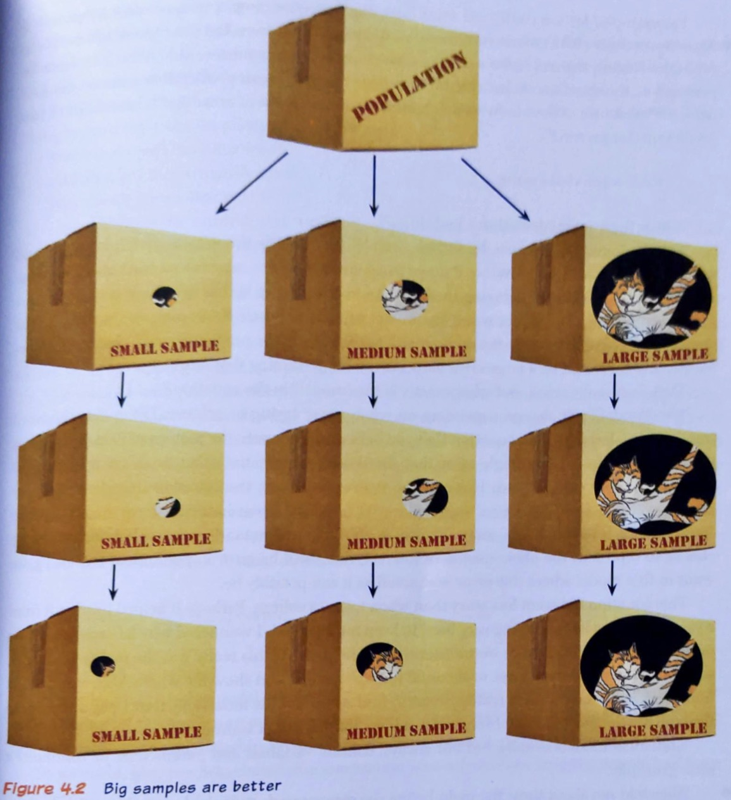

```{r setup, include=FALSE}
library(learnr)
library(data.table)
library(ggplot2)
library(magrittr)
knitr::opts_chunk$set(echo = FALSE)
```

## Statistical inference

### Menti: Would I lie to you? & I find statistics...

> Arguably, the whole job of statistics is *inductive reasoning*: the derivation
> of general principles from specific observations.  

#### Examples

- learning about a population from a sample
- learning about a mechanism from experiments 
- learning about a hypothetical intervention from current practice

Almost inevitably, these inductions will not be logical certainties.

Imagine you've tossed a coin three times, and got tails, heads, tails (in that order).
Run the following code a few times. `P1`, `P2` and `P3` all represent theories about how your sequence of coin tosses came about. Which one of `P1`, `P2`, or `P3` makes an output of 1,0,1 most likely? Why?


```{r binomial, exercise = TRUE}
P1 <- function() {
  rbinom(3, size = 1, prob = 1/3) # three tosses of a single coin
}

P2 <- function() {
  rbinom(3, size = 1, prob = 2/3)
}

P3 <- function() {
  rbinom(3, size = 1, prob = 3/3)
}

P1()
P2()
P3()
```

Challenge: can you write a function that takes any two of the data generating mechanisms and formally compares their likelihood to produce the data 1,0,1?

```{r likelihood_ratio-setup}
P1 <- function() {
  rbinom(3, size = 1, prob = 1/3) # three tosses of a single coin
}

P2 <- function() {
  rbinom(3, size = 1, prob = 2/3)
}

P3 <- function() {
  rbinom(3, size = 1, prob = 3/3)
}
```

```{r likelihood_ratio, exercise = TRUE}
likelihood_ratio <- function(Pi = P1, Pj = P2, nSims = 1e3) {
  i <- replicate(nSims, ...) # replace ... with a test to see if Pi() equals c(1, 0, 1)
  j <- replicate(nSims, ...) # similarly for Pj()
  sum(i) / sum(j)
}

likelihood_ratio(P1, P2)
```

```{r likelihood_ratio-solution}
likelihood_ratio <- function(Pi, Pj, nSims = 1e3) {
  i <- replicate(nSims, all(Pi() == c(1, 0, 1)))
  j <- replicate(nSims, all(Pj() == c(1, 0, 1)))
  sum(i) / sum(j)
}
```

## Population and sample

It is usually impractical to study a whole population or data-generating mechanism.

Sometimes, even if we *could* study a whole population, it still wouldn't tell us everything we wanted to know. This next example helps show why.

Imagine you're studying the voting intentions of the 19 members of an executive committee over a period of 100 days. 

Why isn't it good enough to know everyone's voting intentions on 1 January, say? The following code may help to think it through.

```{r voting-setup}
n <- 19
m <- 100 

voting_intentions <- data.table(
  individual = rep(1:n, each = m),
  date = as.Date("2020-10-31") + 1:m,
  plan = c("A", "B")[1 + cumsum(rbinom(n * m, size = 1, prob = 0.01)) %% 2]
)
```

```{r voting, exercise = TRUE}
ggplot(voting_intentions, aes(x = date, y = individual, colour = plan)) + geom_point()
```

Run the following code a few times to see that it matters which day we ask people what plan they'll vote for.

```{r time, exercise = TRUE, exercise.setup = "voting-setup"}
str(voting_intentions)

voting_intentions[date == sample(date, 1), table(plan)]
```

### What *is* statistics? What is it *for*?

{width="50%"}

> Just as a telescope allows us to discern things too distant to be seen with the
> naked eye, and a microscope allows us to discern things too small to be seen
> with the naked eye, so *statistics allows us to discern things too complex to be
> seen with the naked eye*. 
>
> ---David Hand

So, rather than think about statistics describing populations, think instead of the subject as describing how *some aspect of the world works*, together with its associated complexity. 

Can you come up with other examples where our 'sample' is not just a random subset of some population? For starters, you could think about

- the weather
- the stock market
- cell cultures
- blood samples
- Covid swabs

## Sampling

### Menti: Ask me anything

{width="50%"}

Let's try to reconstruct where the polls from the famous 1948 presidential election went wrong.

```{r truman}
popn_props <- poll_props <- intend_truman <-
  structure(array(dim = c(3, 2),
      dimnames = list(demographic = 1:3, has_phone = 0:1)),
    class = "truman")

popn_props[] <- cbind(c(5, 25, 20), c(20, 25, 5)) / 100
intend_truman[] <- cbind(c(30, 50, 70), c(30, 50, 70)) / 100
vote_truman <- intend_truman + 0.05
plot.truman <- function(x, y, ...) {
  fr <- CJ(demographic = 1:3, has_phone = factor(0:1))
  fr[has_phone == "0", propn := x[, "0"]]
  fr[has_phone == "1", propn := x[, "1"]]
  ggplot(fr, aes(x = demographic, fill = has_phone, y = propn)) + geom_bar(stat = "identity", position = "dodge")
} 
```

Run this code block to show population proportions in different groups.

```{r population, exercise = TRUE, exercise.setup = "truman"}
popn_props
plot(popn_props)
```

And this next code block shows the probability of voting for Harry Truman within each of these groups (`intend_truman`), at some point shortly before the election actually took place. You'll notice that voting intentions don't vary with phone ownership, but do vary by demographic.

```{r intentions, exercise = TRUE, exercise.setup = "truman"}
intend_truman
plot(intend_truman)
```

The Chicago Daily Tribune might have been expecting a dip in support for Truman, but actually he got a late boost. Modify the next chunk of code to reflect this.

```{r vote, exercise = TRUE, exercise.setup = "truman"}
vote_truman <- intend_truman - 0.05 # modify this line to give Truman a late 5% boost
plot(vote_truman)

sum(popn_props * intend_truman) # hypothetical early vote
sum(popn_props * vote_truman) # actual vote
```

```{r vote-solution}
vote_truman <- intend_truman + 0.05
```

The Tribune also didn't poll people according to the population proportions in `popn_props`. Experiment with the expected results from a telephone poll, or if they only polled people in 'demographic 1'.

```{r phone, exercise = TRUE, exercise.setup = "truman"}
poll_props[] <- c(1, 0, 0, 0, 0, 0) # modify this line to investigate polling strategies

poll_props

sum(poll_props * intend_truman) # polling results
sum(popn_props * vote_truman) # actual vote
```

```{r phone-solution}
poll_props[] <- c(0, 0, 0, 0.4, 0.5, 0.1) # representative poll of phone users
poll_props[] <- c(0.8, 0, 0, 0.2, 0, 0) # representative poll of demographic 1
```

## Sampling variation

It is said that

> All statisticians ever do is add things up and divide by $n$.

However, this is *deeply* unfair.

> Sometimes, we add things up and divide by $n - 1$.

(This quote comes from my PhD supervisor, Robin Henderson, in response to a joking (but not) observation from an applied mathematician.)

It's not important at the moment why we might divide by $n - 1$. What *is* important is that we do this when we're thinking about *variation*: the point is that statisticians are indeed interested in means, but also---perhaps *especially*---in variances.

Let's suppose that serum albumin values measured in patients with primary biliary cirrhosis (PBC) can be assumed to have a normal distribution with a mean of about 35 g/l and a standard deviation of about 6 g/l.

Run this code a few times to see just how different individuals can be one from another.

```{r individuals, exercise = TRUE}
rnorm(1, mean = 35, sd = 6)
```

Suppose we had a sample of 25 such individuals: we could then visualize this variation with a histogram. Re-run the code a few times and notice that there is also considerable variation from one *sample* to another.

```{r distribution, exercise = TRUE}
rnorm(25, mean = 35, sd = 6) %>%
  hist(main = NULL, xlim = c(0, 70), ylim = c(0, 12))
  # does the same thing as hist(rnorm(25, mean = 35, sd = 6), ...)
```

Let's pop a few samples on the same picture, and identify the mean of each.

```{r samples-setup}
n_samples <- 20
samples <- data.table(sample = rep(1:n_samples, each = 25),
  albumin = rnorm(n_samples * 25, mean = 35, sd = 6))

means <- samples[, list(mean_albumin = mean(albumin)), by = sample]
```

```{r samples, exercise = TRUE}
str(samples)
str(means)

ggplot(samples, aes(x = sample, y = albumin)) + geom_point(size = 0.5) +
  geom_point(data = means, aes(y = mean_albumin),
    size = 4, colour = "darkred", shape = 18)
```

What do you notice?

```{r variance, echo = FALSE}
question("The means of the samples... (select ALL that apply)",
  answer("...are all the same."),
  answer("...are all different.", correct = TRUE),
  answer("...are more variable than the original data."),
  answer("...are less variable than the original data.", correct = TRUE),
  incorrect = "Are you sure? Have another look."
)
```

## Sampling distribution of the mean

### Menti: What's your idea of a BIG number?

What happens if we change the sample size? Here's some data generated and plotted in exactly the same way, except that now we have sample sizes of 5, 10, 15, 20 and 25.

```{r samplesize-setup}
n_samples <- 20
samples <- data.table(n = seq(5, 25, by = 5))
samples <- samples[, list(sample = rep(1:n_samples, each = n),
  albumin = rnorm(n_samples * n, mean = 35, sd = 6)), by = n]

means <- samples[, list(mean_albumin = mean(albumin)), by = list(n, sample)]
standard_errors <- means[, list(sd_mean_albumin = sd(mean_albumin)), by = n]
ref_lines <- data.table(expand.grid(n = 5:25, sigma = 6, option = c("sigma-n/sigma", "sigma/n", "sigma/n^2", "sigma/sqrt(n)")))
ref_lines[, sd_mean_albumin := eval(parse(text = as.character(option))), by = list(n, option)]
```

```{r samplesize, exercise = TRUE}
ggplot(samples, aes(x = sample, y = albumin)) + geom_point(size = 0.5) +
  geom_point(data = means, aes(y = mean_albumin),
    size = 4, colour = "darkred", shape = 18) +
  facet_grid(~ n, labeller = purrr::partial(label_both, sep = " = "))
```

What do you notice?

```{r variance_decrease, echo = FALSE}
question("The variation in the... (select ALL that apply)",
  answer("...original data increases with sample size."),
  answer("...original data decreases with sample size."),
  answer("...sample means increases with sample size."),
  answer("...sample means decreases with sample size.", correct = TRUE),
  incorrect = "Try running the code again if you're not sure.", type = "multiple"
)
```

The point is that the sample mean also has a distribution:

```{r sample_mean, exercise = TRUE, exercise.setup = "samplesize-setup"}
ggplot(samples, aes(x = albumin)) + geom_density() +
  geom_density(data = means, aes(x = mean_albumin), colour = "darkred") +
  facet_grid(~ n, labeller = purrr::partial(label_both, sep = " = "))
```

Roughly, the *law of large numbers* says that we can expect the distribution of sample means to concentrate around the population mean as sample size increases.

I really like how Andy Field visualizes this idea in his [graphic novel](https://www.amazon.co.uk/Adventure-Statistics-Reality-Enigma-dp-1529797144/dp/1529797144/ref=dp_ob_title_bk) (you read that right!) "An adventure in statistics":

{width=75%}

The protaganist Zach concludes (p120, at least in the first edition): 

> 'So what you're saying is that small samples don't give you a good "view" on the phenomenon in the population, and different small samples are likely to show different things, but with big samples you get a better "view" of the phenomenon that you're trying to study and what you "see" is likely to be similar across these big samples.'

When asked *how large is a large sample*, Milton the cat / professor replies:

> 'That very much depends on the situation, but for now, just focus on the idea that with samples bigger is better. The same cannot be said for dogs.'

## Standard error

If $X_{1}, \ldots, X_{n}$ are *independent* and *identically distributed* with variance $\mathrm{Var}(X_{i}) = \sigma^{2}$, then $$\mathrm{Var}(\overline{X}) = \mathrm{Var}\left(\frac{1}{n} \sum_{i = 1}^{n} X_{i}\right) = \frac{1}{n^{2}} \mathrm{Var}\left(\sum_{i = 1}^{n} X_{i}\right) = \frac{1}{n^{2}} \sum_{i = 1}^{n} \mathrm{Var}(X_{i}) = \frac{1}{n^{2}} \sum_{i = 1}^{n} \sigma^{2} = \frac{1}{n^{2}} n \sigma^{2} = \frac{1}{n} \sigma^{2}.$$

(Where in this proof did we use independence? What about identical distributions?)

So the variance of the sample mean decreases with the reciprocal of (that is, one-over) sample size.

> We sometimes call the *standard deviation of the sample mean* the "standard error" of the mean.

Run the following code a few times:
```{r sd_decrease, exercise = TRUE, exercise.setup = "samplesize-setup"}
str(standard_errors)
str(ref_lines)

ggplot(standard_errors, aes(x = n, y = sd_mean_albumin)) +
  geom_point(colour = "darkred") + geom_line(data = ref_lines, aes(colour = option))
```

```{r sd_question, echo = FALSE}
question(" At what rate does the standard deviation of the sample mean decrease?",
  answer("Linearly with sample size."),
  answer("With the reciprocal of sample size."),
  answer("With the reciprocal of the square of sample size."),
  answer("With the reciprocal of the square root of sample size.", correct = TRUE),
  incorrect = "There is a law of diminishing returns here."
)
```

(Can you prove it?)

> More generally, we refer to standard deviations of *estimators* (of whatever) as "standard errors".

The "error" terminology can be helpful in reminding us that we are trying to estimate something.

### Menti: Ask me anything

## The bootstrap

### Menti: My favourite urban legend is...

> "The attempt of the mind to analyze itself [is] an effort analogous to one who would lift himself by his own bootstraps." (1860)

{width="50%"}

Almost invariably we have only one set of data:
```{r single_sample, echo = FALSE}
set.seed(0)
our_sample <- rnorm(25, mean = 35, sd = 6)
set.seed(NULL)
```

```{r show_sample, exercise = TRUE, exercise.setup = "single_sample"}
sort(our_sample)
hist(our_sample)
```

What's the difference between these two lines? (Run the code a few times if you need a clue.)

```{r resample, exercise = TRUE, exercise.setup = "single_sample"}
sample(our_sample, replace = FALSE) %>% sort()
sample(our_sample, replace = TRUE) %>% sort()
```

We can repeatedly resample our *single* set of data. Just as before, the mean will vary from (re)sample to (re)sample:

```{r bootstrap, exercise = TRUE, exercise.setup = "single_sample"}
resamples <- data.table(sample = rep(1:20, each = 25),
  albumin = sample(our_sample, 20 * 25, replace = TRUE))

remeans <- resamples[, list(mean_albumin = mean(albumin)), by = sample]

ggplot(resamples, aes(x = sample, y = albumin)) + geom_point(size = 0.5) +
  geom_point(data = remeans, aes(y = mean_albumin),
    size = 4, colour = "darkred", shape = 18)
```

Compare this to the hypothetical operation of resampling from the data-generating mechanism:

```{r samples_again, exercise = TRUE, exercise.setup = "samples-setup"}
ggplot(samples, aes(x = sample, y = albumin)) + geom_point(size = 0.5) +
  geom_point(data = means, aes(y = mean_albumin),
    size = 4, colour = "darkred", shape = 18)
```

Discuss similarities and differences between these last two pictures.

Use the following code to work out the standard error of the mean using only the original sample:

```{r bootstrap_se, exercise = TRUE, exercise.setup = "single_sample"}
mean(our_sample) # this is the mean, but how *variable* is this estimate?
sd(our_sample) / sqrt(25) # this is one estimate of the standard error of the mean

# this code uses the 'magrittr' forward pipe operator to show the bootstrap's logic

replicate(1e3,
  our_sample %>% sample(replace = TRUE) %>% mean()
) %>% sd()

# Can you fill in the arguments of this function to write it in a more standard way?

sd(replicate(..., mean(sample(...))))
```

```{r bootstrap_se-solution}
sd(replicate(1e3, mean(sample(our_sample, replace = TRUE))))
```

Remarkably, we have arrived at an estimate of the precision of our estimated mean, *using only the single sample we have available to us*. But why are these numbers different each time we run the code?

## Central Limit Theorem

Does it surprise you that we can say something about the precision of an estimate using only a single sample?


Here are some distributions we might be sampling from:

```{r distributions-setup, echo = FALSE, warning = FALSE}
densities <- data.table(distribution = "Normal", x = seq(-3, 3, length.out = 100)) %>% extract(, density := dnorm(x, mean = 0, sd = 1)) %>%
  rbind(data.table(distribution = "Uniform", x = seq(0, 1, length.out = 100)) %>% extract(, density := dunif(x, min = 0, max = 1))) %>%
  rbind(data.table(distribution = "Bernoulli", x = seq(0, 1, length.out = 100)) %>% extract(, density := dbinom(x, size = 1, prob = 0.5))) %>%
  rbind(data.table(distribution = "Log-Normal", x = seq(0, 5, length.out = 100)) %>% extract(, density := dlnorm(x, meanlog = 0, sdlog = 1))) %>%
  rbind(data.table(distribution = "Cauchy", x = seq(-10, 10, length.out = 100)) %>% extract(, density := dcauchy(x, location = 0, scale = 1)))
```

```{r distributions, exercise = TRUE, warning = FALSE}
ggplot(densities, aes(x = x, y = density)) + geom_line() +
  facet_grid(~ distribution, scales = "free")
```

And here is what their sample means look like:
```{r clt-setup, echo = FALSE}
data.table(distribution = "Normal", simulation_fn = function(n) rnorm(n, mean = 0, sd = 1)) %>%
  rbind(data.table(distribution = "Uniform", simulation_fn = function(n) runif(n, min = 0, max = 1))) %>%
  rbind(data.table(distribution = "Bernoulli", simulation_fn = function(n) rbinom(n, size = 1, prob = 0.5))) %>%
  rbind(data.table(distribution = "Log-Normal", simulation_fn = function(n) rlnorm(n, meanlog = 0, sdlog = 1))) %>%
  rbind(data.table(distribution = "Cauchy", simulation_fn = function(n) rcauchy(n, location = 0, scale = 1))) %>%
  extract(, data.table(simulation_fn, n = 5 * (1:5)), by = list(distribution)) -> setups

nSims <- 1e3
setups %>% extract(, {
  list(sample_num = 1:nSims,
       sample_mean = replicate(nSims, n %>% simulation_fn[[1]]() %>% mean))
}, by = list(n, distribution)) -> sample_means
```

```{r clt, exercise = TRUE}
ggplot(sample_means, aes(x = sample_mean)) + geom_density() +
  facet_grid(n ~ distribution, scales = "free")
```
Discuss the meaning of these pictures. Do any of them alarm you?

### Menti: My favourite distribution is...

Your turn: create a weird distribution and explore how sample means behave. Explore sample sizes other than 10.

```{r weird, exercise = TRUE}
my_weird_sample <- function(n) {
  rlnorm(n, meanlog = 0, sdlog = 1) + 20 * rbinom(n, size = 2, prob = 0.5)
}

my_weird_sample(n = 1e5) %>% density() %>% plot()
# plots the density of your weird distribution

replicate(1e5, my_weird_sample(n = 10)) %>% apply(2, mean) %>% density() %>% plot()
# plots the density of the sample means of your weird distibution
```

### Menti: Ask me anything

Homework: explore the sampling distribution of the variance, the standard deviation and the (natural) logarithm of the standard deviation.
